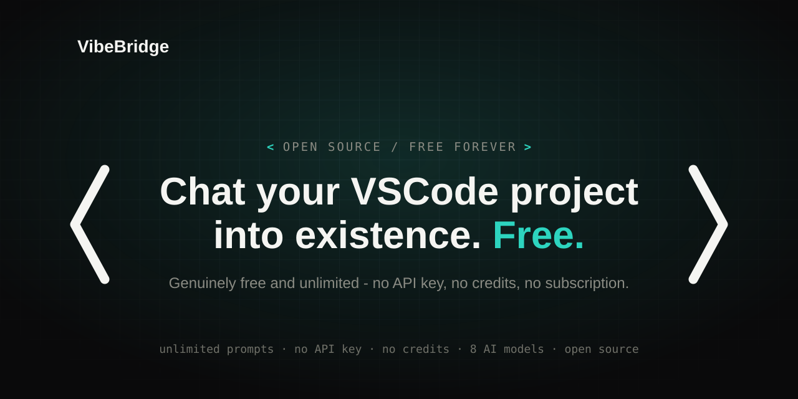

# VibeBridge - Free AI Agent for VSCode



**VibeBridge** is a free browser extension that turns ChatGPT, DeepSeek, Gemini, Kimi, GLM, Qwen, Arena or Meta AI into a VSCode coding agent.
Control your project with AI directly from your browser - read/edit files, run terminal commands, check diagnostics, preview diffs, all from a normal AI chat. No API key, no sign-in, no payment. Free, forever.

> Forked from [ZeroScript Free](https://github.com/sebattfg/ZeroScript-Free) by
> sebattfg (GPL-3.0, same license as this project). Same extension, same
> providers, same agent loop - only the application changed: Roblox Studio →
> VSCode.

Eight AI providers are supported: **DeepSeek** (chat.deepseek.com, recommended), **ChatGPT** (chatgpt.com), **Google Gemini** (gemini.google.com), **Kimi** (kimi.ai), **GLM** (chat.z.ai), **Qwen** (chat.qwen.ai), **Arena** (arena.ai) and **Meta AI** (meta.ai). DeepSeek is the recommended provider (most stable with the agent loop).

## How it works

```
AI chat (ChatGPT / DeepSeek / Gemini / Kimi / GLM / Qwen / Arena / Meta AI, in your browser)
  -> VibeBridge Extension -> Bridge (your PC) -> VSCode
```

The extension runs inside the chat page. When you type a request, it sends commands to the Bridge running on your PC, which drives your VSCode workspace: files and terminal directly, and live editor state (active file, diagnostics, visual diffs) through the [VS Code MCP Bridge](https://marketplace.visualstudio.com/items?itemName=jhamama.vscode-mcp-bridge-ext) extension by jhamama.

## Full setup tutorial

### Step 0 - What you need

- Windows or macOS
- [VSCode](https://code.visualstudio.com/) installed
- Microsoft Edge or Chrome
- Python 3.9+ ([python.org/downloads](https://www.python.org/downloads/) - on
  Windows it can also be installed automatically by `start.bat`)

### Step 1 - Prepare VSCode (do this once)

1. Install [**VS Code MCP Bridge**](https://marketplace.visualstudio.com/items?itemName=jhamama.vscode-mcp-bridge-ext)
   (jhamama) — click the link, then **Install** (or in VSCode: Extensions view
   → search "VS Code MCP Bridge" → Install).
2. Open your project: **File > Open Folder** and pick your project folder.
3. If VSCode asks whether to trust the folder, click **Trust** (required, otherwise
   extensions - including the MCP server - stay disabled).
4. Start the MCP server: press **Cmd+Shift+P** (macOS) or **Ctrl+Shift+P**
   (Windows/Linux), type **"VS Code MCP Bridge: Start Server"**, press Enter.
   The status bar (bottom right) shows `MCP :3333` when it is running.
5. Leave VSCode open. The agent cannot reach a closed VSCode.

### Step 2 - Install the browser extension (do this once)

1. Download this repo (Code > Download ZIP) and extract it anywhere.
2. Go to `edge://extensions` (Edge) or `chrome://extensions` (Chrome).
3. Enable **Developer mode** (top right toggle).
4. Click **Load unpacked** and select the `vibebridge-extension` folder from
   the extracted download.

> Only enable ONE of VibeBridge / ZeroScript at a time - both inject into the
> same chat pages and would each mount their own bar.

### Step 3 - Run the Bridge (every time you want to use the agent)

- **Windows:** double-click `start.bat` inside the extracted folder.
- **macOS:** double-click `MacOS_Start.command` inside the extracted folder.
  The first time, macOS shows a security warning ("could not verify... free of
  malware") - this is normal for any script downloaded outside the App Store.
  Click **Done**, then go to **System Settings > Privacy & Security**, scroll
  to the bottom, and click **Open Anyway**. You only need to do this once.

A small window opens and ends with a green `ready ... VSCode connected` line -
that means the Bridge is running. **Keep this window open** (minimize it);
VibeBridge stops working if you close it.

### Step 4 - Start a session

1. Go to https://chat.deepseek.com (recommended) or any supported chat and open
   a **new, empty chat**.
2. The VibeBridge bar appears above the input box. If it says anything other
   than Standby (e.g. it names a missing step), follow that step first.
3. Click **Start VSCode agent**. The bar turns green: `Agent active · N tools`.
4. Type what you want, e.g. "list the files in src, then read package.json".

### Step 5 - Working with the agent

- Write **one task per message** and wait for the result before the next.
- The agent shows each tool call as a chip (spinning → green done / red error).
  Click a chip to expand the full command and result.
- Before writing a file it previews the change in VSCode's diff view; after
  writing it re-checks diagnostics.
- Project memory lives in `MEMORY.md` at your workspace root - the agent reads
  and updates it across sessions, so it remembers your project.

## What the AI can do

- Read files (`read_file`), list files (`list_files`), search code (`grep`)
- Edit files (`write_file`) with diff preview (`show_diff`)
- See the active file and cursor (`get_active_file`), open files (`open_file`)
- Read LSP errors/warnings (`get_diagnostics`)
- Run terminal commands (`run_terminal`: build, lint, tests)
- Check workspace info (`get_workspace_info`) and bridge health (`vscode_status`)
- **Remember your project across sessions** (`MEMORY.md` in your workspace root)

## Panel status

| Dot | Meaning |
|-----|---------|
| Green | Bridge + VSCode ready (a folder is open, MCP server on) |
| Yellow | Bridge OK, but VSCode isn't usable yet - open VSCode, open a folder, start its MCP server (hover the dot for the exact reason) |
| Grey | Bridge offline - run start.bat (Windows) or MacOS_Start.command (macOS) |

The Start button stays locked until the dot can go green. If you click it
early, a banner tells you the exact missing step instead of failing silently.

## Troubleshooting

**Bar says "Run start.bat on your PC" (grey dot).**
The Bridge is not running. Run `start.bat` / `MacOS_Start.command` and keep
the window open. If it exits with an error, read the last lines - a missing
Python is the most common cause.

**Bar says "VSCode MCP server is off" (yellow dot).**
VSCode is reachable but its MCP server is not started. In VSCode:
Cmd+Shift+P → "VS Code MCP Bridge: Start Server". The status bar must show
`MCP :3333`.

**"No agent here. Open a new chat to start one."**
You opened an existing conversation. Start works only on a new, empty chat.

**"Disconnected · reload this page".**
Chrome reloaded/updated the extension under the open tab. Reload the page (F5).

**A tool chip turned red.**
Click it to expand - the error text names the real cause (usually a wrong path
or a VSCode hiccup). Fix and ask the model to retry.

**Port 17613 already in use.**
Another bridge is still running (or another app took the port). Close the old
bridge window and relaunch. Override: `ZS_BRIDGE_PORT=17614` before launching.

**macOS keeps blocking MacOS_Start.command.**
System Settings > Privacy & Security → scroll down → Open Anyway. Once.

## Requirements

- Windows or macOS
- VSCode + [**VS Code MCP Bridge**](https://marketplace.visualstudio.com/items?itemName=jhamama.vscode-mcp-bridge-ext) extension (jhamama)
- Microsoft Edge or Chrome
- Python 3.9+

## Security & office compliance

Be honest about the model - especially before using VibeBridge on work projects:

**Where your data goes.**
Everything the agent reads (file contents, terminal output, diagnostics) is
pasted into a third-party AI chat (DeepSeek, ChatGPT, ...), under that
provider's data policy. Free tiers may use conversations for training. The
bridge and extension themselves send nothing anywhere else (localhost only,
no telemetry - the code is open for audit).

**Office checklist (do this first).**
1. Get permission - check your company's AI/data policy or ask IT. Pasting
   company code into a free AI chat can violate policy at many workplaces.
2. Keep it to non-sensitive projects - never repos containing customer data,
   PII, production credentials or unreleased IP unless explicitly allowed.
3. Prefer an AI account with training/data-sharing turned off, where available.

**Built-in guardrails (on by default).**
- Secret-looking files (`.env*`, `*.pem`, `*secret*`, `*credential*`,
  private keys, `*.p12`, `.npmrc`, tokens...) are **refused outright** by
  every file tool - the model is told why and must not work around it.
- Likely secrets inside tool output (API keys, tokens, private-key blocks)
  are **auto-redacted** before anything reaches the AI. Redaction never
  touches what gets written to disk.
- Every tool call is logged locally to `logs/vb_audit.jsonl` (time, tool,
  target, bytes/lines sent, redaction count) - your audit trail if anyone asks
  what left the machine.

**License note.** Using VibeBridge does NOT make your code GPL - copyleft only
applies if you distribute the tool itself. Your project keeps its own license.

## License

GPL-3.0, same as upstream ZeroScript Free. See LICENSE.
